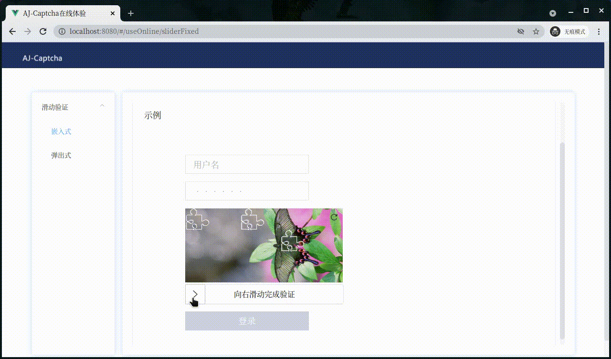

# Go-Captcha

滑动验证码，这几年非常流行，但是很少有公司自己代码实现，大都是几大公司提供的api。[AJ-Captcha](https://gitee.com/anji-plus/captcha)是java为数不多的开源实现。

本人参考`AJ-Captcha`，用golang重新实现滑动验证码`go-captcha`,并将他开源。
- [github](https://github.com/widaT/go-captcha)
- [gitee](https://gitee.com/wida/go-captcha)


## 滑动验证码原理

- 精心选择一定宽高固定的底图
- 设计滑块图，滑块需要png格式，一般高度和底图一样，除了滑块图片其他的像素为全透明
- 随机选择底图和滑块图
- 随机出抠图X轴位置
- 从底图X位置扣出以滑块图为模板不透明的像素，生成新的滑块。

## 为什么用go造轮子

- AJ-Captcha 使用java实现，项目依赖spring boot，相对项目比较庞大复杂。
- 使用go重写，可以顺利融合go生态
- 优化一些算法，优化依赖，核心算法不依赖第三方。


## 核心实现

```go
// cutOut 抠图
func cutOut(bgImage, bkImage, newBkImage *ImageBuf, x int) {
	var values [9]color.RGBA64
	bkWidth := bkImage.getWidth()
	bkHeight := bkImage.getHeight()
	for i := 0; i < bkWidth; i++ {
		for j := 0; j < bkHeight; j++ {
			pixel := bkImage.getRGBA(i, j)
			// 滑块图片非透明像素点，从背景图偏移x 像素拷贝到新图层
			if pixel.A > 0 {
				newBkImage.setRGBA(i, j, bgImage.getRGBA(x+i, j))
				readNeighborPixel(bgImage, x+i, j, &values)
				bgImage.setRGBA(x+i, j, gaussianBlur(&values))
			}

			if i == (bkWidth-1) || j == (bkHeight-1) {
				continue
			}
			rightPixel := bkImage.getRGBA(i+1, j)
			bottomPixel := bkImage.getRGBA(i, j+1)
			// 用白色给底图和新图层描边
			if (pixel.A > 0 && rightPixel.A == 0) ||
				(pixel.A == 0 && rightPixel.A > 0) ||
				(pixel.A > 0 && bottomPixel.A == 0) ||
				(pixel.A == 0 && bottomPixel.A > 0) {
				white := color.White
				newBkImage.setRGBA(i, j, white)
				bgImage.setRGBA(x+i, j, white)
			}
		}
	}
}

//readNeighborPixel 读取邻近9个点像素，后面最类似高斯模糊计算
//（并非严格的高斯模糊，高斯模糊算法效率太低，本例不需要严格的高斯模糊算法）
// |2|3|4|
// |5|1|6|
// |7|8|9|
// 中心点为1
func readNeighborPixel(img *ImageBuf, x, y int, pixels *[9]color.RGBA64) {
	xStart := x - 1
	yStart := y - 1
	current := 0
	for i := xStart; i < 3+xStart; i++ {
		for j := yStart; j < 3+yStart; j++ {
			tx := i
			if tx < 0 {
				tx = -tx
			} else if tx >= img.getWidth() {
				tx = x
			}
			ty := j
			if ty < 0 {
				ty = -ty
			} else if ty >= img.getHeight() {
				ty = y
			}
			pixels[current] = img.getRGBA(tx, ty)
			current++
		}
	}
}

// gaussianBlur 类高斯模糊算法
func gaussianBlur(values *[9]color.RGBA64) color.RGBA64 {
	//这边需要 uint32 防止多个uint16相加后溢出
	var r uint32
	var g uint32
	var b uint32
	var a uint32
	for i := 0; i < len(values); i++ {
		if i == 4 { //去掉中间原像素点
			continue
		}
		x := values[i]
		r += uint32(x.R)
		g += uint32(x.G)
		b += uint32(x.B)
		a += uint32(x.A)
	}
	return color.RGBA64{
		uint16(r / 8),
		uint16(g / 8),
		uint16(b / 8),
		uint16(a / 8)}
}
```

## 看效果




## Thanks

- 欢迎大家使用，并提供反馈。
- 同时感谢[AJ-Captcha](https://gitee.com/anji-plus/captcha)的开源。